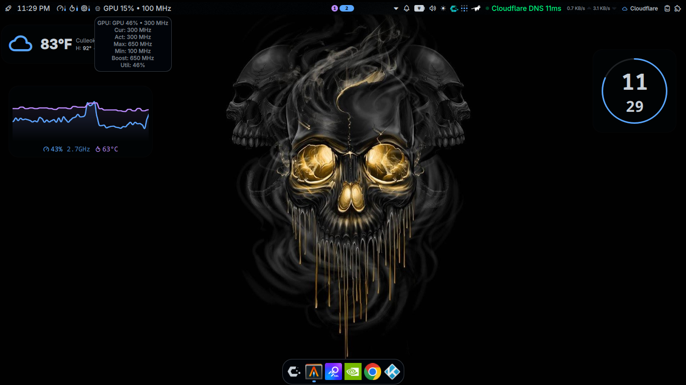

# GPU Frequency Monitor for Noctalia

A sleek, real-time GPU frequency and utilization monitor widget for [Noctalia](https://github.com/Noctalia/noctalia) (QuickShell-based Wayland bar). Designed for Intel integrated graphics (tested on Intel UHD 600 / Celeron N4020), this plugin reads directly from the kernel's DRM sysfs interface to display current, min, max, boost, and active frequencies with a live utilization graph.




---

## Features

| Feature | Description |
|---------|-------------|
| **Real-time frequencies** | Current, Active, Min, Max, Boost, RP0, RP1, RPn (MHz) |
| **Utilization %** | Live GPU utilization calculated as `active_freq / max_freq` |
| **Live graph** | Scrolling 60-second history with hover tooltips showing exact MHz at each point |
| **Threshold lines** | Visual 50% (warning) and 80% (critical) utilization markers on graph |
| **Min/Max/Boost row** | Quick-reference cards with color-coded labels |
| **Status badge** | Dynamic badge: `IDLE` / `LIGHT LOAD` / `MODERATE LOAD` / `HIGH LOAD` |
| **Bar widget** | Compact bar display: `GPU XX% • YYY MHz` with hover tooltip showing all freqs |
| **Settings panel** | Toggle visibility of Max/Min/Boost/Util via right-click → Settings |
| **Zero-config** | Works out of the box on Intel iGPU (card1) with proper udev permissions |

---

## Screenshots

> **Add screenshots here** — drag `panel-preview.png` and `bar-widget-preview.png` into `assets/` folder.

---

## Requirements

| Component | Version / Notes |
|-----------|-----------------|
| **Noctalia / QuickShell** | ≥ 4.7.6 (uses `qs.Services.UI`, `qs.Widgets`, `FileView`) |
| **Kernel** | Linux 5.10+ with `drm/i915` exposing `gt_*_freq_mhz` sysfs files |
| **GPU** | Tested on Intel UHD 600 (Celeron N4020, `card1`) — works on any Intel iGPU with GT frequency sysfs |
| **Permissions** | `/sys/class/drm/card1/gt_*_freq_mhz` must be readable (udev rule below) |

---

## Installation

### 1. Install the plugin

```bash
# Clone into Noctalia's plugin directory
git clone https://github.com/keviis850/noctalia-gpu-freq.git \
  ~/.config/noctalia/plugins/gpu-freq
```

### 2. Set up udev permissions (required)

Create `/etc/udev/rules.d/99-intel-gpu-perms.rules`:

```bash
sudo tee /etc/udev/rules.d/99-intel-gpu-perms.rules <<'EOF'
KERNEL=="card1", SUBSYSTEM=="drm", MODE="0644"
EOF
```

Reload udev and verify:

```bash
sudo udevadm control --reload-rules && sudo udevadm trigger
cat /sys/class/drm/card1/gt_cur_freq_mhz  # should print a number, not "Permission denied"
```

> **Note:** If your GPU is on `card0` or `card2`, adjust the rule and the plugin's `Main.qml` paths accordingly (see [Configuration](#configuration)).

### 3. Enable in Noctalia

1. Open Noctalia settings → **Plugins** → find **GPU Freq** → enable it
2. Add to bar: right-click bar → **Add Widget** → **GPU Freq**
3. (Optional) Add to panel: right-click desktop → **Panel** → **GPU Freq**

### 4. Restart Noctalia

```bash
pkill -f quickshell && quickshell &
# or use your launch script
```

---

## Configuration

### Plugin Settings (GUI)

Right-click the bar widget → **Settings** to toggle:

| Setting | Default | Description |
|---------|---------|-------------|
| `showUtil` | `true` | Show utilization % and active freq in bar widget |
| `showMax` | `false` | Show `cur / max MHz` format |
| `showMin` | `false` | Show min frequency |
| `showBoost` | `false` | Show boost frequency |

Settings persist in Noctalia's `settings.json`.

### Hardware Configuration (Main.qml)

If your GPU is not on `card1`, edit `Main.qml` and change all paths:

```qml
// Change card1 → card0 (or card2, etc.)
path: "/sys/class/drm/card1/gt_cur_freq_mhz"
```

The plugin reads these sysfs files:

| File | Meaning |
|------|---------|
| `gt_cur_freq_mhz` | Current requested frequency |
| `gt_act_freq_mhz` | Actual current frequency |
| `gt_min_freq_mhz` | Minimum frequency |
| `gt_max_freq_mhz` | Maximum frequency |
| `gt_boost_freq_mhz` | Boost/turbo frequency |
| `gt_RP0_freq_mhz` | Render Performance state 0 (max perf) |
| `gt_RP1_freq_mhz` | Render Performance state 1 |
| `gt_RPn_freq_mhz` | Render Performance state n (min power) |

---

## Architecture

```
gpu-freq/
├── manifest.json       # Plugin metadata, entry points, default settings
├── Main.qml            # Singleton: reads sysfs, exposes bindings (curFreq, utilization, etc.)
├── BarWidget.qml       # Bar item: compact display + tooltip + context menu
├── Panel.qml           # Full panel: graph, history, min/max/boost row, status badge
└── assets/             # Screenshots (add your own)
```

### Data Flow

1. **Main.qml** (`FileView` + `Timer`) polls `/sys/class/drm/card1/gt_*_freq_mhz` every 1.5s
2. Parses values → exposes `curFreq`, `actFreq`, `maxFreq`, `utilizationPercent`, etc.
3. **BarWidget.qml** reads via `pluginApi.mainInstance` → shows compact text + hover tooltip
4. **Panel.qml** reads same bindings → renders live graph (`NGraph`), history tooltips, status badge

---

## Customization

### Colors (Panel.qml)

```qml
readonly property color colorGood: "#22c55e"      // Green (low utilization)
readonly property color colorWarning: "#f59e0b"   // Amber (50-80%)
readonly property color colorCritical: "#ef4444"  // Red (>80%)
```

### Graph History Length

In `Panel.qml`, the `freqHistory` array keeps 60 samples (1 per second). Adjust:

```qml
// In the timer or data accumulation logic
if (freqHistory.length > 60) freqHistory.shift()  // Change 60 to desired seconds
```

### Thresholds (Status Badge)

```qml
// Panel.qml lines 408-413
text: root.utilizationPercent > 80 ? "HIGH LOAD" :
      root.utilizationPercent > 50 ? "MODERATE LOAD" :
      root.utilizationPercent > 10 ? "LIGHT LOAD" : "IDLE"
```

---

## Troubleshooting

| Symptom | Fix |
|---------|-----|
| Bar shows `GPU ?% • ? MHz` | Udev rule missing or wrong `cardN` — check `ls /sys/class/drm/` |
| Panel graph flat at 0 | `gt_max_freq_mhz` returns 0 or missing — verify file exists and is readable |
| QML errors on startup | Ensure Noctalia/QuickShell ≥ 4.7.6; check `quickshell --version` |
| Widget not appearing in bar | Enable plugin in Noctalia settings → Plugins → GPU Freq → Enable |
| Permission denied on sysfs | Re-run udev rule + `sudo udevadm trigger`; verify with `cat /sys/class/drm/card1/gt_cur_freq_mhz` |

---

## Compatibility

| GPU / Driver | Status | Notes |
|--------------|--------|-------|
| Intel UHD 600 (i915, card1) | ✅ Tested | Celeron N4020, 4GB RAM |
| Intel UHD 630 / 730 / 770 | ✅ Should work | Same `gt_*_freq_mhz` interface |
| Intel Arc (Xe) | ❓ Untested | May use different sysfs paths |
| AMD (amdgpu) | ❌ No | Uses `pp_dpm_*` / `freq*_mhz` — different interface |
| NVIDIA (nvidia / nouveau) | ❌ No | No standard GPU freq sysfs exposure |

**Want AMD/NVIDIA support?** Open an issue or PR — contributions welcome!

---

## Contributing

1. Fork the repo
2. Create a feature branch: `git checkout -b feat/amazing-feature`
3. Commit changes: `git commit -m "feat: add amazing feature"`
4. Push and open a PR

### Code Style

- 4-space indentation (QML standard)
- Semicolons optional but consistent
- Descriptive property names (`curFreqRaw` not `cfr`)
- Comment non-obvious logic

---

## License

MIT License — see [LICENSE](LICENSE) for details.

---

## Credits

- **Author**: [keviis850](https://github.com/keviis850)
- **Inspired by**: Noctalia's built-in `system-monitor`, `latency-monitor`, `network-indicator` widgets
- **Built for**: [Noctalia](https://github.com/Noctalia/noctalia) / [QuickShell](https://github.com/quickshell/quickshell)
- **OS**: CachyOS (Arch-based), Niri compositor, 4GB RAM / Celeron N4020

---

## Changelog

### v0.1.0 (2025-07-16)
- Initial release
- Bar widget with utilization % + active freq
- Full panel with live graph, history tooltips, min/max/boost row, status badge
- Settings toggles for display modes
- Udev rule documentation for Intel iGPU permissions