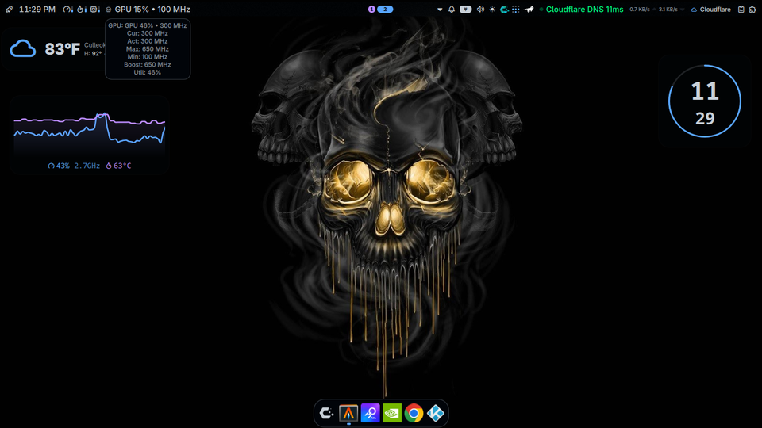

# GPU Frequency Monitor for Noctalia

[](https://github.com/KeviiS850/noctalia-gpu-freq/releases)
[](LICENSE)

A real-time Intel iGPU frequency and utilization monitor widget for
[Noctalia](https://github.com/Noctalia-OSS/noctalia) (Quickshell-based
Wayland bar). Reads `/sys/class/drm/<card>/gt_*_freq_mhz` and renders a
compact pill with a hover tooltip, configurable display modes, and a
right-click settings dialog.

> Tested on Intel UHD 600 (Celeron N4020) under CachyOS + Niri.

---

## Features

| Feature | Description |
|---------|-------------|
| **Real-time frequencies** | Cur, Act, Min, Max, Boost (MHz) |
| **Utilization %** | `active_freq / max_freq`, clamped 0-100% |
| **Compact bar pill** | `XX%` or `Cur / Max MHz` - config-toggleable |
| **Hover tooltip** | All five frequencies + util at a glance |
| **Right-click settings** | Toggle display modes, change GPU card |
| **Auto-detection trait** | `autoDetectCard` flag ready for cross-GPU support |
| **Zero-config** | Works out of the box on Intel iGPU with udev permission |

---

## Screenshots



---

## Requirements

| Component | Version / Notes |
|-----------|-----------------|
| **Noctalia / Quickshell** | >= 4.7.6 (`qs.Services.UI`, `qs.Widgets`, `FileView`) |
| **Kernel** | Linux 5.10+ with `drm/i915` GT sysfs |
| **GPU** | Intel UHD 600+ (any Intel iGPU with `gt_*_freq_mhz`) |
| **Permissions** | `udev` rule or run-as-root |
| **Display** | Tested on single-monitor Niri, 4 GB RAM |

---

## Quick install

```bash
curl -fsSL https://raw.githubusercontent.com/KeviiS850/noctalia-gpu-freq/main/install.sh | bash
sudo cp ~/.config/noctalia/plugins/gpu-freq/99-intel-gpu-perms.rules /etc/udev/rules.d/
sudo udevadm control --reload-rules && sudo udevadm trigger
```

Restart Noctalia and the widget appears under bar settings.

---

## Manual install

```bash
git clone https://github.com/KeviiS850/noctalia-gpu-freq.git \
  ~/.config/noctalia/plugins/gpu-freq
sudo cp ~/.config/noctalia/plugins/gpu-freq/99-intel-gpu-perms.rules /etc/udev/rules.d/
sudo udevadm control --reload-rules && sudo udevadm trigger
```

## Enable in Noctalia

1. Settings -> Plugins -> enable **GPU Frequency**
2. Right-click bar -> Add Widget -> **GPU Frequency**
3. (Optional) Right-click widget -> Settings -> toggle display options

---

## Configuration

### Plugin Settings (GUI)

Right-click the bar widget -> **Settings** to toggle:

| Setting | Default | Description |
|---------|---------|-------------|
| `showUtil` | `true` | Show utilization % in bar widget |
| `showMax` | `true` | Show `cur / max MHz` format |
| `showMin` | `false` | Show min frequency |
| `showBoost` | `false` | Show boost frequency |
| `gpuCard` | `card1` | GPU DRM card identifier (`card0`, `card1`, `card2`) |
| `autoDetectCard` | `true` | Hook for future detection logic |
| `pollIntervalMs` | `1500` | Polling cadence (ms) |

Settings persist in Noctalia's `settings.json` under `bar.widgets.<section>`.
When you remove the widget the entry disappears cleanly.

### Hardware Configuration

If the configured `gpuCard` doesn't exist, the plugin still loads and falls
back to `"?"`-labeled values; no crash. The widget never pulls in or breaks
the bar layout when sysfs is unreadable.

The plugin monitors these sysfs files (all under `/sys/class/drm/<card>/`):

| File | Meaning |
|------|---------|
| `gt_cur_freq_mhz` | Current requested frequency |
| `gt_act_freq_mhz` | Actual current frequency |
| `gt_min_freq_mhz` | Minimum frequency |
| `gt_max_freq_mhz` | Maximum frequency |
| `gt_boost_freq_mhz` | Boost / turbo frequency |

---

## Architecture

```
gpu-freq/
├── manifest.json       # Plugin metadata, entry points, defaults
├── Main.qml            # Singleton: sysfs polling, exposed bindings
├── BarWidget.qml       # Bar item: BarPill, tooltip, context menu
├── Panel.qml           # Optional detail panel (Plugin Center slot)
├── PluginSettings.qml  # Right-click -> settings toggles form
├── install.sh          # One-line installer
├── 99-intel-gpu-perms.rules  # Udev rule template
├── LICENSE
├── README.md
└── CHANGELOG.md
```

### Data flow

1. `Main.qml` polls sysfs every `pollIntervalMs` (default 1500 ms) via `FileView`.
2. Parsed values flow through safe numeric helpers to `curFreq`, `actFreq`, `minFreq`, `maxFreq`, `boostFreq`, `utilizationPercent`.
3. `BarWidget.qml` reads via `pluginApi.mainInstance` and renders the `BarPill`.
4. Right-click menu -> `PluginSettings.qml` for source-of-truth toggles.

---

## Customization

### Polling interval

In `Main.qml`:

```qml
Timer {
    interval: 1500  // ms, change to taste
    running: true
    repeat: true
    triggeredOnStart: true
    onTriggered: { /* ... */ }
}
```

Or set `pollIntervalMs` in the plugin settings dialog (no rebuild required
for the schema change; the value is read once at singleton init - drop it
to 750 ms for snappier updates).

### GPU card

Set via plugin settings (`gpuCard`) or edit the `gpuCard` default in
`manifest.json -> defaultSettings`.

---

## Troubleshooting

| Symptom | Fix |
|---------|-----|
| Bar shows `XX%` only but values are wrong | Wrong `gpuCard` - check `ls /sys/class/drm/` and update via Settings dialog |
| Bar displays nothing | Udev rule missing - run `sudo udevadm trigger` and verify `cat /sys/class/drm/card1/gt_cur_freq_mhz` works |
| QML errors on startup | Run Noctalia in foreground (see Launching Quickshell below) |
| Widget not appearing in bar | Settings -> Plugins -> enable **GPU Frequency** -> Add to bar |
| Tooltip shows `?` everywhere | sysfs unreadable - confirm udev rule is loaded |

### Launching Quickshell

To see live QML errors during development:

```bash
# Kill the running shell (waits for full reload)
pkill -9 quickshell
# Restart in foreground with stderr visible
~/.config/niri/scripts/launch-noctalia.sh 2>&1 | tee /tmp/qs.log
```

Quickshell prints parse/binding errors to stderr; check `/tmp/qs.log` after
the bar has been rendered once.

---

## Compatibility

| GPU / Driver | Status | Notes |
|--------------|--------|-------|
| Intel UHD 600 (i915, card1) | Tested | Celeron N4020, 4 GB RAM |
| Intel UHD 630 / 730 / 770 | Should work | Same `gt_*_freq_mhz` interface |
| Intel Arc (Xe) | Untested | May use different sysfs paths |
| AMD (amdgpu) | No | Uses `pp_dpm_*` / `freq*_mhz` - different interface |
| NVIDIA (nvidia / nouveau) | No | No standard GPU freq sysfs exposure |

**Want AMD/NVIDIA support?** Open an issue or PR - contributions welcome!

---

## Contributing

1. Fork the repo
2. Create a feature branch: `git checkout -b feat/amazing-feature`
3. Commit changes: `git commit -m "feat: add amazing feature"`
4. Push and open a PR

### Code Style

- 4-space indentation (QML standard)
- Descriptive property names (`curFreqRaw` not `cfr`)
- Comment non-obvious logic
- One responsibility per `.qml` entry point

---

## License

MIT License - see [LICENSE](LICENSE) for details.

---

## Credits

- **Author**: [KeviiS850](https://github.com/KeviiS850)
- Inspired by Noctalia's built-in `system-monitor`, `latency-monitor`, `network-indicator` widgets
- Built for [Noctalia](https://github.com/Noctalia-OSS/noctalia) / [QuickShell](https://github.com/quickshell-mirror/quickshell)
- OS: CachyOS (Arch-based), Niri compositor, 4 GB RAM / Celeron N4020

For the complete changelog see [CHANGELOG.md](CHANGELOG.md).
